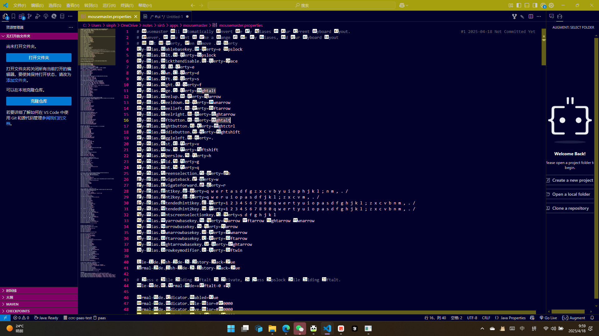
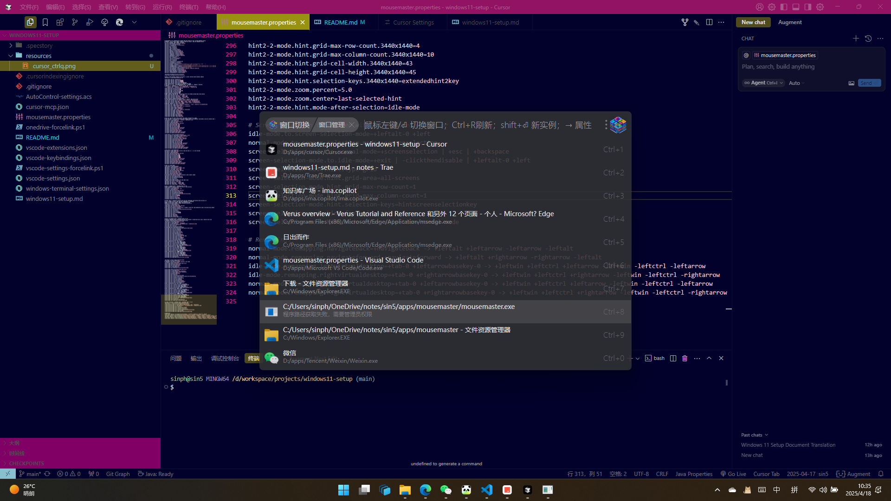
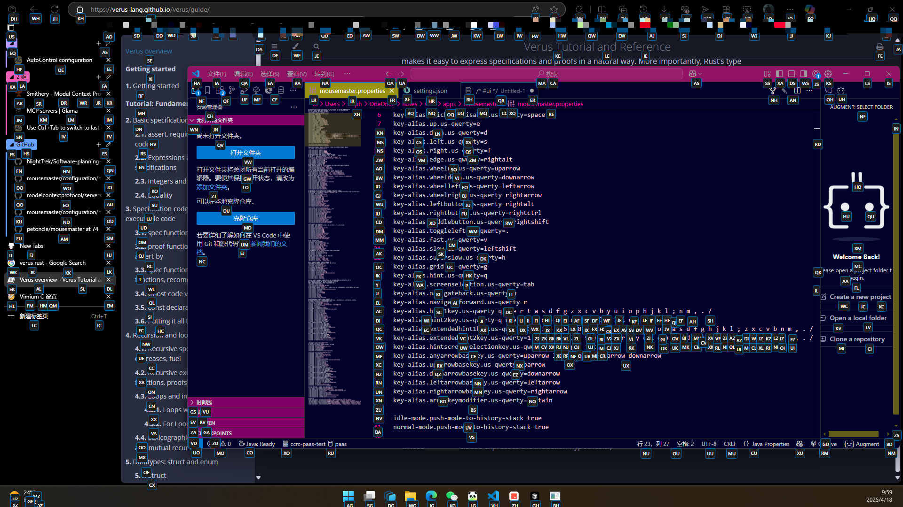

# Windows 11 Setup

*赛博差生文具屯, 电子阳痿跑分魂*

## Description
This repository serves as a comprehensive operation manual for setting up a highly efficient Windows 11 development environment. It focuses on creating a unified, keyboard-centric workflow while maintaining mouse accessibility. The setup leverages several powerful tools:

- **OneDrive**: Cloud synchronization for seamless configuration migration
- **uTools**: Efficient productivity enhancement with quick search and automation
- **PowerToys**: Microsoft's power user tools for advanced Windows customization
- **MouseMaster**: Mouse gesture and keyboard simulation for enhanced navigation
- **Fluent Search**: Fast system-wide search and window management
- **AutoControl**: Auto control for mouse and keyboard
- **Cursor**: AI-powered code editor

The documentation includes detailed shortcut configurations, environment setup procedures, and best practices for maintaining a consistent development environment across multiple machines.

**Key Features:**
- 🔄 Unified shortcut system across applications
- ⌨️ Keyboard-first workflow design
- 🖱️ Enhanced mouse operation support
- 🔍 Quick application/window identification
- 🌐 Easy environment migration
- 🎨 Visual workspace organization

**Target Audience:**
- Developers seeking an efficient Windows setup
- Power users looking to optimize their workflow
- Anyone interested in keyboard-centric computing
- Users managing multiple development environments

### 目标
快速高效的windows pc配置
- 统一快捷键方便记忆和使用
- 环境移植方便
- 仅使用键盘操作简便
- 仅使用鼠标操作简便
- 快速识别不同应用
- 快速识别当前聚焦的窗口
- 快速识别当前使用的输入法

### 方案
###### 统一快捷键方便记忆和使用
windows11系统和常见应用特性: 
- 桌面: windows桌面, windows可以创建多个桌面
- 窗口: windows应用程序窗口, 有的应用只有一个窗口实例, 有的应用可以打开多个窗口实例
- 窗格: 应用程序窗口内的窗格, 应用程序内可以创建多个窗格; 例如edge里的分屏,vscode里的编辑器组,windows terminal里的窗格
- 标签页: 应用程序内或窗格内的标签页, 通常可以打开多个标签页; 例如edge里的标签页,vscode里的编辑器,windwos terminal里的标签页,文件资源管理器里的标签页
- 导航栏: 通常位于应用窗口顶部的导航栏, 一般显示标签页的地址; 例如edge里的地址栏,vscode里的导航路径(breadcrumbs),文件资源管理器里的地址栏
- 资源栏: 通常位于应用窗口左侧的垂直栏, 一般显示应用程序的资源列表; 例如edge里的垂直标签页,vscode里的资源管理器,文件资源管理器里的导航窗格
- 侧边栏: 通常位于应用窗口右侧的垂直栏, 一般显示应用程序的专属功能; 例如edge里的copilot侧边栏,vscode里的github copilot,文件资源管理器里的预览窗格
- 控制台: 通常位于应用窗口底部的控制台, 一般显示应用程序的日志; 例如edge里的控制台,vscode里的控制台
- 命令: 执行应用程序的命令
- 设置: 打开系统设置/应用程序设置

常用快捷键:
- 新建
    - 窗口: ctrl+n
    - 窗格: 
        - 向右新建: ctrl+.
        - 向下新建: ctrl+,
    - 标签页: ctrl+t
- 复制
    - 窗口: alt+n+c
    - 窗格: 
        - 向右复制: alt+.+c
        - 向下复制: alt+,+c
    - 标签页: alt+t+c
- 切换(切换显示/切换聚焦)
    - 切换到最近(按住修饰键后可以用方向键选择)
        - 窗口: alt+tab
        - 标签页: ctrl+tab
    - 切换到上一个
        - 窗口: alt+shift+tab
        - 标签页: ctrl+shift+tab
    - 切换到左边
        - 窗格: alt+left
        - 标签页: alt+[
    - 切换到右边
        - 窗格: alt+right
        - 标签页: alt+]
    - 切换到上边
        - 窗格: alt+up
    - 切换到下边
        - 窗格: alt+down
- 搜索并切换到打开的
    - 窗口: win+`
    - 同应用的窗口: alt+`
    - 标签页: ctrl+`
- 搜索并打开历史的
    - 同应用的窗口: alt+shift+`
    - 标签页: ctrl+shift+`
- 关闭
    - 窗口: alt+w
    - 窗格: alt+/
    - 标签页: ctrl+w
- 关闭全部
    - 窗格中的标签页: ctrl+alt+/
    - 标签页: ctrl+alt+w
- 关闭其他全部
    - 窗格中的标签页: ctrl+shift+/
    - 标签页: ctrl+shift+w
- 重新打开关闭的
    - 标签页: ctrl+shift+t
- 移动标签页到
    - 新窗口: alt+t+n
    - (新)窗口
        - 右移: alt+t+=
        - 左移: alt+t+-
    - 新窗格:
        - 向右: alt+t+.
        - 向下: alt+t+,
    - (新)窗格
        - 上移: alt+t+up
        - 下移: alt+t+down
        - 左移: alt+t+left
        - 右移: alt+t+right
    - 标签页
        - 前: alt+t+[
        - 后: alt+t+]
- 移动窗格到
    - 新窗口: alt+.+n
    - (新)窗口: 
        - 右移: alt+.+=
        - 左移: alt+.+-
    - 窗格
        - 左: alt+.+left
        - 右: alt+.+right
        - 上: alt+.+up
        - 下: alt+.+down
- 平移位置:
    - 窗口:
        - 向上: alt+n+e
        - 向下: alt+n+d
        - 向左: alt+n+s
        - 向右: alt+n+f
- 调整大小
    - 窗口: 
        - 向上: alt+n+i
        - 向下: alt+n+k
        - 向左: alt+n+j
        - 向右: alt+n+l
    - 窗格: 
        - 向上: alt+.+i
        - 向下: alt+.+k
        - 向左: alt+.+j
        - 向右: alt+.+l
- 合并
    - 所有窗口: ctrl+alt+n+m
    - 所有窗格: ctrl+alt+.+m
    - 当前窗口到下一个窗口: alt+n+m
    - 当前窗格到下一个窗格: alt+.+m
- 打开书签栏: alt+\
- 打开设置: alt+i
- 执行命令: alt+r
- 后退: ctrl+[
- 前进: ctrl+]
- 打开控制台: alt+del
- 聚焦到导航栏: alt+d
- 搜索内容: ctrl+f
- 重命名: ctrl+2
- 聚焦到资源栏: alt+1
- 聚焦到侧边栏: alt+2

windows系统常用快捷键:
- 窗口贴靠到上半部分: win+alt+up
- 窗口贴靠到下半部分: win+alt+down
- 将窗口移动到左侧屏幕: win+shift+left
- 将窗口移动到右侧屏幕: win+shift+right
- 临时速览桌面: win+,
- 显示和隐藏桌面: win+d
- 打开工作区: win+ctrl+`
- 鼠标跳转: win+q
- 剪贴板: win+v
- 锁屏: win+l
- 打开快速布局选项: win+z
- 语音输入: win+h
- 打开设置: win+i
- 打开小组件: win+w
- 打开Game Bar: win+g
- 在任务栏选择: win+t
- 新建桌面: win+ctrl+d
- 切换应用: alt+tab, 三指滑动
- 切换桌面: win+ctrl+left/right, 四指滑动
- 最大化或还原除活动窗口之外的所有窗口: win+home
- 最小化所有窗口: win+m
- 截图: win+shift+s
- 录屏: win+shift+r

ahk可用键位:
- 鼠标左键: RAlt
- 菜单键: RCtrl

edge常用快捷键:
- 搜索历史标签页: h
- 搜索书签: \
- 搜索打开的标签页和历史: `
- 页面元素定位: q

cursor常用快捷键:
- 添加书签: ctrl+\
- 编辑器代码定位: ctrl+q

- 查看git历史: ctrl+h
- 接受内联建议的下一个字: ctrl+1
- 查看文件历史: alt+3
- 聚焦到git更改: alt+4
- 聚焦到运行和调试: alt+5
- 聚焦到todo: alt+6
- 在文件资源管理器中打开: alt+shift+e
- 在资源管理器视图中显示活动文件: alt+shift+1
- 转到编辑器中的符号: ctrl+3
- 重构: ctrl+6

utools常用快捷键: 
- 搜索切换窗口: win+`

- 搜索文件/文件夹: win+shift+e
- 剪贴板: alt+v
- 搜索浏览器书签: win+\

Fluent Search常用快捷键:
- 搜索屏幕元素: alt+q


mousemaster常用快捷键:
- 激活屏幕hint: alt+f

- 激活屏幕切换: alt+s

- 激活窗口grid: alt+g
- 激活移动: alt+e
    - 移动: e/s/d/f
    - 激活屏幕grid: g
    - 激活屏幕hint: q
    - 切换显示器: tab
    - 减速: shift
    - 退出: capslock
    - 后退: w
    - 前进: r
    - WheelUp: up
    - WheelDown: down
    - WheelLeft: left
    - WheelRight: right
- 点击并退出: space
- 鼠标左键: RAlt
- 鼠标右键: RCtrl

###### 环境移植方便
- 使用onedrive和文件链接同步大部分应用的配置和存档
- 使用scoop下载和配置环境
- 使用windows系统的设置同步, edge的设置同步, vscode的设置同步, utools的同步
- edge使用工作区同步标签页
- 使用文件链接将vscode的设置同步成cursor和trae的设置
###### 仅使用键盘操作简便
- 设置快捷键
- 使用快捷工具: utools, Fluent Search, mousemaster
###### 仅使用鼠标操作简便
- 保留应用在任务栏, 开始菜单的可达性
###### 快速识别不同应用
- edge使用主题, edge使用工作区配置不同的颜色
- vscode使用peacock设置不同实例的主题
###### 快速识别当前聚焦的窗口
- windows设置主题色应用在窗口边框上
###### 快速识别当前使用的输入法
- 使用DynCursor动态修改光标样式

### 实现
1. 激活/安装系统
    1. 添加中文/英语两种键盘布局
    1. 默认关闭fn键
    1. 磁盘管理器->重新分配C盘空间
1. 下载应用程序
    - utools
    - PowerToys
    - clash for windows
    - 微信
    - vscode
    - cursor
    - trae
    - plantuml.jar
    - chrome
    - mousemaster
    - Fluent Search
    - ima.copilot
    - PotPlayer
    - qBittorrent
    - NVIDIA
    - Game Bar小组件murbongCrosshair
1. windows系统设置
    1. 添加或删除程序->卸载用不到的应用
    1. 备份和同步设置->记住我的偏好: 记住全部(首次同步个性化设置需要验证)
    1. 更改用户账户控制设置: 从不通知
    1. 控制面板->键盘->
        1. 重复延迟: 最短
        1. 重复速度: 最快
    1. 控制面板->鼠标->指针选项
        1. 提高指针精确度: 关
        1. 在打字时隐藏指针: 关
    1. 触摸板设置->
        1. 点击: 最高敏感度
        1. 高级手势->
            1. 配置三指手势->
                1. 点击: 鼠标中键
                1. 向上轻扫: 任务视图
                1. 向下轻扫: 除了焦点中的应用之外, 隐藏任何对象
                1. 向左轻扫: 切换应用
                1. 向右轻扫: 切换应用
            1. 配置四指手势->
                1. 点击: 播放/暂停
                1. 向上轻扫: 调高音量
                1. 向下轻扫: 调低音量
                1. 向左轻扫: 切换桌面
                1. 向右轻扫: 切换桌面
    1. 编辑语言和键盘选项->
        1. 简体中文(中国大陆)->语言选项->微软拼音->输入选项->
            1. 常规->
                1. 中文输入时使用英文标点: 开
            1. 按键->
                1. 中/英文模式切换: Shift
                1. 全/半角切换: 无
                1. 中/英文标点切换: 无
                1. 简体/繁体中文输入切换: 关
            1. 外观->
                1. 候选词数: 5
                1. 更改文本输入主题: 选择或自定义主题
                1. 使用输入法工具栏: 关
        1. 输入->
            1. 触摸键盘->显示触摸键盘: 始终
            1. 高级键盘设置->
                1. 允许我为每个应用窗口使用不同的输入法: 关
                1. 使用桌面语言栏(如果可用): diabled
                1. 语言栏选项->语言栏->隐藏: 开
    1. 主题和相关设置->
        1. 背景->个性化设置背景: Windows聚焦
        1. 颜色->
            1. 选择模式: 深色
            1. 透明效果: 开
            1. 在"开始"和任务栏上显示重点颜色: 关
            1. 在标题栏和窗口边框上显示强调色: 开
        1. 桌面图标设置: 取消勾选全部
    1. 电源,睡眠和电池设置->
        1. 屏幕,睡眠和休眠超时->
            1. 关闭屏幕: 从不
            1. 进入睡眠状态: 从不
        1. 盖子,电源和睡眠 按钮控件
            1. 按电源按钮将使我的电脑: 关机
            1. 按睡眠按钮将使我的电脑: 关机
            1. 盖上盖子将使我的电脑: 睡眠
    1. 控制面板->电源选项->更改计划设置->更改高级电源设置->
        1. PCI Express->链接状态电源管理: 关闭
    1. 多任务设置->
        1. 贴靠窗口->
            1. 对齐窗口时, 建议可对齐在窗口旁边的内容: 关
            1. 其他: 开
        1. 对齐或按Alt+Tab时显示应用中的标签页: 不显示选项卡
    1. 剪贴板设置->剪贴板历史记录: 开
    1. "开始"菜单设置->
        1. 布局: 默认
        1. 其他: 开
        1. 文件夹->
            1. 设置: 开
            1. 文件资源管理器: 开
            1. 下载: 开
            1. 文档: 开
            1. 个人文件夹: 开
            1. 其他: 关
    1. 任务栏设置->
        1. 搜索: 隐藏
        1. 任务视图: 开
        1. 小组件: 开
        1. 触摸键盘: 始终
        1. 其他系统托盘图标->隐藏的图标菜单: 开
            1. Microsoft OneDrive: 开
            1. Clash for Windows: 开
            1. Microsoft Phone Link: 开
            1. 其他: 关
        1. 任务栏行为->
            1. 任务栏对齐方式: 居中
            1. 自动隐藏任务栏: 关
            1. 在任务栏应用上显示徽章: 关
            1. 显示任务栏应用上的闪烁: 开
            1. 在所有显示器上显示任务栏: 开
            1. 当使用多个显示器时, 在以下位置显示我的任务栏应用: 所有任务栏
            1. 从任务栏共享任何窗口: 开
            1. 单击任务栏右下角以显示桌面: 开
            1. 合并任务栏按钮并隐藏标签: 始终
            1. 合并任务栏按钮并隐藏其他任务栏上的标签: 始终
    1. 通知和操作->通知: 关
1. windows文件资源管理器设置
    1. 快速访问->
        1. 下载
        1. C:\Users\sinph
    1. 查看->
        1. 项目复选框
        1. 文件扩展名
        1. 隐藏的项目
    1. 选项->
        1. 常规->打开文件资源管理器时打开: 此电脑
        1. 查看->
            1. 显示此电脑: 开
            1. 显示库: 开
            1. 在标题栏中显示完整路径: 开
1. windows terminal设置
    1. [settings.json](./windows-terminal-settings.md)
1. 手机连接设置
    1. 设备->添加设备
1. 设置clash
    1. Profile->Import
    1. Settings-> Appearance->Theme->Dark
    1. General->
        1. System Proxy: 开
        1. Start with Windows: 开
1. 设置OneDrive
    1. 同步并备份->管理备份->
        1. 文档: 开
1. 设置edge
    1. 右键标题栏: 隐藏标题栏
    1. 个人资料->
        1. 同步: 全部启用
    1. 隐私,搜索和服务->搜索和连接体验->地址栏和搜索->
        1. 地址栏中使用的搜索引擎: Google
        1. 管理搜索引擎->
            1. g google
            1. bd 百度 
            1. b bing
            1. ` 标签页
            1. \ 收藏夹
            1. h 历史记录
            1. map 百度地图 https://map.baidu.com/search/%s
            1. db 豆瓣 https://search.douban.com/movie/subject_search?search_text=%scat=1002
            1. git GitHub https://github.com/search?q=%s
    1. 外观->
        1. 整体外观: 深色
        1. 主题: 黑色主题
        1. 工具栏->
            1. 在标题栏中显示个人资料图标: 关
            1. 显示收藏夹栏: 始终
            1. 选择要在工具栏上显示的按钮->
                1. 前进: 自动显示
                1. 后退: 自动显示
                1. 集锦: 开
                1. 拆分屏幕: 开
                1. 历史: 开
                1. 应用: 开
                1. 下载: 开
                1. Drop: 开
                1. 屏幕截图: 开
                1. 其他: 关
        1. 浏览器行为和功能
            1. 在关闭具有多个选项卡的窗口之前询问: 关
            1. 启用鼠标手势: 关
            1. 配置拆分屏幕->链接选项卡: 开
    1. 侧栏->
        1. 边栏可见性: 关
        1. 应用和通知设置->Copilot->显示工具栏上的Copilot按钮: 开
    1. 默认浏览器->Microsoft Edge 是默认浏览器: 设为默认值       
    1. 扩展->
        1. AdGuard 广告拦截器
        1. Octotree - GitHub code tree
        1. Sider: ChatGPT 侧边栏
        1. Vimium C - 全键盘操作浏览器
            1. 扩展选项->
                1. 自定义快捷键:
                ```
                map ` Vomnibar.activate
                map h Vomnibar.activateHistory
                map \ Vomnibar.activateBookmarks
                map q LinkHints.activate
                ```
                1. 默认搜索引擎: https://www.google.com.hk/search?q=$s
        1. iGG谷歌学术助手
        1. 篡改猴
        1. [BrowserTools MCP](https://github.com/AgentDeskAI/browser-tools-mcp)
        1. AutoControl: Keyboard shortcuts, Mouse gestures
            1. install native component
            1. 扩展选项->Options->[restore from file](./AutoControl-settings.acs)
        1. GITHUBER - New Tab
            1. 打开新标签页->Setting->
                1. Goal opening method: 全部关闭
                1. Show Bookmark: 关
                1. Night Mode: 开
                1. Reposities搜索条件: This week, All Languages
        1. Google 翻译
        1. Tab Modifier
1. 设置utools
    1. 设置->
        1. 呼出快捷键: alt+space
        1. 屏幕悬浮球: 关
        1. 启用超级面板: 关
        1. 主题: 暗黑
        1. 搜索框窗口不透明度: 90%
        1. 搜索框占位符: whatsup
        1. 开机启动: 开
        1. 分离为独立窗口快捷键: ctrl+n
        1. 搜索框模式: 聚合模式
        1. 搜索框显示最近使用: 开
        1. 启动软件/文件: 开
        1. 空格键执行打开: 开
        1. 自动粘贴搜索框: 2秒内
        1. 自动清空搜索框: 1分钟
    1. 快捷方式->
        1. 全局快捷键->
            1. win+`: 窗口管理 
            1. win+\:bookmarks
            1. win+shift+e: find
            1. alt+v: clipboard
        1. 指令别名->
            1. \: bookmarks
            1. e: find
            1. t: 翻译
            1. d: dict
    1. 插件->
        1. 剪贴板
        1. 中英词典 
        1. 颜色助手
        1. 浏览器书签搜索
        1. todo
        1. Medis
        1. Markdown 笔记
        1. hosts 切换
        1. 网页快开
            1. 内置: 关闭全部
            1. 我的自定义->
                1. g https://www.google.com.hk/search?q={query}
                1. bd https://www.baidu.com/s?wd={query}
                1. db https://search.douban.com/movie/subject_search?search_text={query}&cat=1002
                1. git https://github.com/search?q={query}
        1. 录屏 & 视频处理
        1. 快捷命令
            1. 默认->
                1. 执行shell命令: 开
                1. 其他: 关
            1. 新建命令->终端管理员
                1. 环境: PowerShell
                1. 关键词: 管理员, su1
                1. 输出: 忽略输出并隐藏, 禁用(进入插件后才执行命令)
                1. 平台: Windows
                1. 代码: Start-Process "wt.exe" -Verb RunAs
        1. 汇率换算
        1. 关闭进程
        1. 窗口切换
        1. 备忘快贴
            1. New-Item
                1. 创建文件链接(需要管理员身份运行): `New-Item -ItemType SymbolicLink -Path "C:\Users\sinph\OneDrive\Users\sinph\.cursor" -Target "C:\Users\sinph\.cursor" -Force`
            1. cargo
                1. tauri打包桌面端可执行文件: `cargo tauri build`
            1. git
                1. 生成RSA密钥对: `ssh-keygen -t rsa -b 4096 -C "your_email@example.com"`
                1. 查看公钥文件: `cat ~/.ssh/id_rsa.pub`
                1. .gitignore: 
                ```
                HELP.md
                target/
                !.mvn/wrapper/maven-wrapper.jar
                !**/src/main/**/target/
                !**/src/test/**/target/

                ### STS ###
                .apt_generated
                .classpath
                .factorypath
                .project
                .settings
                .springBeans
                .sts4-cache

                ### IntelliJ IDEA ###
                .idea
                *.iws
                *.iml
                *.ipr

                ### NetBeans ###
                /nbproject/private/
                /nbbuild/
                /dist/
                /nbdist/
                /.nb-gradle/
                build/
                !**/src/main/**/build/
                !**/src/test/**/build/

                ### VS Code ###
                **/.vscode
                **/target
                **/.specstory
                **/.cursor
                **/.history
                ```
            1. kubectl
                1. 进入pod默认容器的bash: `kubectl exec -it <pod-name> -n <namespace> -- /bin/sh`
                1. 查看指定命名空间的pods: `kubectl get pods -n <namespace>`
                1. 查看崩溃容器的日志: `kubectl logs --previous <pod-name> -n <namespace>`
                1. 查看指定时间段的日志: `kubectl logs --since-time="2024-07-01T09:00:00Z" <pod-name> -n <namespace>`
                1. 查看pod指定容器日志: `kubectl logs <pod-name> -c <container-name> -n <namespace>`
                1. 查看pod实时日志: `kubectl logs -f <pod-name> -n <namespace>`
                1. 查看deployments: `kubectl get deployments -n <namespace>`
            1. mvn
                1. 依赖树分析: `mvn dependency:tree`
            1. npx
                1. 启动figma mcp server: `npx figma-developer-mcp --figma-api-key=<myApiKey>`
                1. 启动browsertools mcp server(注意要用管理员身份启动): `npx @agentdeskai/browser-tools-server`
                1. 创建react router项目: `npx create-react-router@latest`
                1. tauri打包安卓apk: `npx @tauri-apps/cli android build`
                1. tauri在连接的安卓手机或模拟器上运行应用: `npx @tauri-apps/cli android dev`
            1. python 
                1. 创建venv环境: `python -m venv .venv`
                1. 激活venv环境: `.venv\Scripts\activate`
                1. 推出venv环境: `deactivate`
        1. AI助手
        1. 聚合翻译
        1. OCR 文字识别
        1. 计算稿纸
        1. 本地搜索
1. 设置PowerToys
    1. 仪表板: Always On Top, 鼠标跳转, FancyZones, File Locksmith, 图像大小调整器, 键盘管理器, PowerRename, 注册表预览, 工作区
    1. 鼠标跳转->
        1. 激活快捷键: win+q
        1. 缩略图大小: 800*450
    1. 键盘管理器->
        1. 重新映射键->
            1. Esc->CapsLock
            1. CapsLock->Esc
            1. Home->PgUp
            1. End->PgDn
            1. PgUp->Home
            1. PgDn->End
        1. 重新映射快捷键->
            1. alt+w->alt+f4
            1. ctrl+[->alt+left in explorer.exe
            1. ctrl+]->alt+right in explorer.exe
    1. 常规->
        1. 始终以管理员身份运行: 关
        1. 开机自启动: 开
        1. 备份和还原设置->选择文件夹: C:\Users\sinph\OneDrive\notes\sin5\config\powertoys
1. 安装vscode
    1. 将code操作添加到上下文菜单
1. 设置vscode
    1. 打开设置同步
    1. [settings.json](./vscode-settings.json)
    1. [keybindings.json](./vscode-keybindings.json)
    1. [extensions.json](./vscode-extensions.json)
        1. jumpy->extension.jumpy-word: ctrl+q
        1. Bookmarks->
            1. bookmarks.toggle: ctrl+\
            1. bookmarksExplorer.focus: alt+\
        1. Git Graph->gitgraph.view: ctrl+h
1. 安装cursor
    1. 将cursor操作添加到上下文菜单
1. 设置cursor
    1. Rule
        1. User Rules:
        ```
        Always response in 中文.
        ```
        1. [Project Rules](https://cursor.directory/rules)
    1. MCP->[mcp.json](./cursor-mcp.json)
1. 安装Trae
    1. 将trae操作添加到上下文菜单
1. 下载plantuml.jar
    1. 下载[plantuml.jar](https://plantuml.com/zh/download)到C:\Users\sinph\OneDrive\notes\sin5\env\plantuml\plantuml.jar
    1. 设置vscode的plantuml.jar地址: `"markdown-preview-enhanced.plantumlJarPath": "C:\\Users\\sinph\\OneDrive\\notes\\sin5\\env\\plantuml\\plantuml.jar"`
1. 安装chrome
1. 安装mousemaster
    1. 下载[mousemaster](https://github.com/petoncle/mousemaster/tree/74)
    1. 使用配置文件[neo-mousekeys-ijkl.properties](https://github.com/petoncle/mousemaster/blob/74/configuration/neo-mousekeys-ijkl.md)
    1. 重命名配置文件为`mousemaster.properties`, 将配置文件和.exe文件放在同一目录下: C:\Users\sinph\OneDrive\notes\sin5\apps\mousemaster
1. 设置mousemaster
    1. 去除idle模式下的alt修饰键拦截
    1. 参考[keylist.md](https://github.com/petoncle/mousemaster/blob/74/configuration/key-list.md)修改合适的键位: esdf风格的左手单手键位设置[mousemaster.properties](./mousemaster.properties)
    1. 右键修改属性->兼容性->以管理员身份运行
1. 安装Fluent Search
    1. 下载[portable](https://fluentsearch.net/)版本到C:\Users\sinph\OneDrive\notes\sin5\apps\fluent-search-portable
1. 设置Fluent Search
    1. 应用程序->
        1. 设置->启动->开机启动: 开
        1. 屏幕->
            1. 屏幕搜索快捷键: alt+q
            1. 点击后鼠标停留: 开
            1. 屏幕搜索外观和自定义->
                1. 屏幕搜索块尺寸: 10
                1. 显示屏幕搜索快边框: 开
                1. 矩形位置: 下方居中
1. 安装[DynCursor](https://github.com/alvinfunborn/DynCursor)
    1. 安装到目录C:\Users\sinph\OneDrive\notes\sin5\apps\DynCursor
1. 创建[keyboardMouseClick.ahk](https://github.com/alvinfunborn/KeyboardMouseClick)
    1. 创建在C:\Users\sinph\OneDrive\notes\sin5\apps\keyboardMouseClick.ahk
1. 开机启动DynCursor.exe, keyboardMouseClick.ahk, mousemaster.exe
    1. 创建DynCursor.exe, keyboardMouseClick.ahk, mousemaster.exe的桌面快捷方式
    1. win+r运行`shell:startup`打开启动文件夹
    1. 将桌面快捷方式拖入启动文件夹
1. 安装scoop
    1. 终端运行
    ```
    Set-ExecutionPolicy -ExecutionPolicy RemoteSigned -Scope CurrentUser
    Invoke-RestMethod -Uri https://get.scoop.sh | Invoke-Expression
    ```
    1. 创建githubtoken
        1. 访问 [GitHub tokens 设置](https://github.com/settings/tokens)
        1. 配置scoop github token: `scoop config gh_token <myToken>`
    1. 使用scoop
    ```
    scoop bucket add extras
    scoop bucket add java
    scoop bucket add dorado https://github.com/chawyehsu/dorado
    scoop install git
    scoop install jdk17
    scoop install nodejs
    scoop install python
    scoop install maven
    scoop install rust
    scoop install autohotkey
    scoop install mysql-shell
    scoop install kubectl
    scoop install kt-connect
    ```
    1. git设置
    ```
    git config --global user.name "<USER>"
    git config --global user.email "<EMAIL>"
    git config --global http.proxy 127.0.0.1:7890
    git config --global https.proxy 127.0.0.1:7890
    ```
1. 设置ima.copilot
    1. 随时唤起ima: alt+p
    1. AI划词工具栏: 仅在ima中使用
1. 安装game小组件
    1. win+g打开Game Bar安装小组件`murbongCrosshair`
    1. 设置murbongCrosshair
        1. thickness: 1.0
        1. size: 9
        1. gap: -6
        1. center screen
        1. pin
1. 任务管理器设置
    1. 启动应用: OneDrive.exe, utools.exe, Clash for Windows.exe, DynCursor.exe, keyboardMouseClick.ahk, 移动设备, mousemaster, Fluent Search
1. 使用OneDrive
    1. 将以下文件剪切到OneDrive里对应目录下C:\Users\...->C:\Users\sinph\OneDrive\Users\...
        1. C:\Users\sinph\.cursor\mcp.json
        1. C:\Users\sinph\.leigod\app.json
        1. C:\Users\sinph\.ssh\id_rsa
        1. C:\Users\sinph\.ssh\id_rsa.pub
        1. C:\Users\sinph\.ssh\known_hosts
        1. C:\Users\sinph\AppData\Local\Lossless Scaling\Settings.xml
        1. C:\Users\sinph\AppData\Roaming\qBittorrent\qBittorrent.ini
        1. C:\Users\sinph\AppData\Roaming\utools\settings
        1. C:\Users\sinph\.config\scoop\config.json
        1. C:\Users\sinph\scoop\persist\maven\conf\settings.xml
        1. C:\Users\sinph\OneDrive\Users\sinph\.gitconfig
    1. 将OneDrive中Users目录下的文件创建符号链接到C:\Users下对应的位置
        1. 终端中以管理员身份运行脚本[onedrive-forcelink.ps1](./onedrive-forcelink.ps1)
1. vscode,cursor,trae的vscode系编辑器设置同步
    1. 将vscode的设置链接到cursor和trae的设置
        1. 终端中以管理员身份运行脚本[vscode-settings-forcelink.ps1](./vscode-settings-forcelink.ps1)

### 使用
1. 激活/安装系统
    1. 添加中文/英语两种键盘布局
    1. 默认关闭fn键
    1. 磁盘管理器->重新分配C盘空间
1. 下载应用程序
    - utools
    - PowerToys
    - clash for windows
    - 微信
    - vscode
    - cursor
    - trae
    - chrome
    - ima.copilot
    - PotPlayer
    - qBittorrent
    - 迅雷
    - NVIDIA
    - Game Bar小组件murbongCrosshair
1. windows系统设置
    1. 添加或删除程序->卸载用不到的应用
    1. 备份和同步设置->记住我的偏好: 记住全部(首次同步个性化设置需要验证)
1. windows文件资源管理器设置
    1. 快速访问->
        1. 下载
        1. C:\Users\sinph
    1. 查看->
        1. 项目复选框
        1. 文件扩展名
        1. 隐藏的项目
    1. 选项->
        1. 常规->打开文件资源管理器时打开: 此电脑
        1. 查看->
            1. 显示此电脑: 开
            1. 显示库: 开
            1. 在标题栏中显示完整路径: 开
1. windows terminal设置
    1. [settings.json](./windows-terminal-settings.md)
1. 手机连接设置
    1. 设备->添加设备
1. 设置clash
    1. Profile->Import
    1. Settings-> Appearance->Theme->Dark
    1. General->
        1. System Proxy: 开
        1. Start with Windows: 开
1. 打开OneDrive下载所有同步文件
1. 设置edge
    1. 扩展->
        1. [BrowserTools MCP](https://github.com/AgentDeskAI/browser-tools-mcp)
        1. GITHUBER - New Tab
            1. 打开新标签页->Setting->
                1. Goal opening method: 全部关闭
                1. Show Bookmark: 关
                1. Night Mode: 开
                1. Reposities搜索条件: This week, All Languages
1. 安装utools
1. 设置PowerToys
    1. 常规->
        1. 还原->选择文件夹: C:\Users\sinph\OneDrive\notes\sin5\config\powertoys
1. 安装vscode
    1. 将code操作添加到上下文菜单
1. 安装cursor
    1. 将cursor操作添加到上下文菜单
1. 安装Trae
    1. 将trae操作添加到上下文菜单
1. 安装chrome
1. 安装scoop
    1. 终端运行
    ```
    Set-ExecutionPolicy -ExecutionPolicy RemoteSigned -Scope CurrentUser
    Invoke-RestMethod -Uri https://get.scoop.sh | Invoke-Expression
    ```
1. OneDrive已下载[DynCursor](https://github.com/alvinfunborn/DynCursor)在C:\Users\sinph\OneDrive\notes\sin5\apps\DynCursor
1. OneDrive已下载`keyboardMouseClick.ahk`在C:\Users\sinph\OneDrive\notes\sin5\apps\keyboardMouseClick.ahk
1. OneDrive已下载[mousemaster](https://github.com/petoncle/mousemaster/tree/74)在C:\Users\sinph\OneDrive\notes\sin5\apps\mousemaster
1. OneDrive已下载[Fluent Search](https://fluentsearch.net/)在C:\Users\sinph\OneDrive\notes\sin5\apps\fluent-search-portable
1. 开机启动DynCursor.exe, keyboardMouseClick.ahk, mousemaster.exe
    1. 创建DynCursor.exe, keyboardMouseClick.ahk, mousemaster.exe的桌面快捷方式
    1. win+r运行`shell:startup`打开启动文件夹
    1. 将桌面快捷方式拖入启动文件夹
1. 设置ima.copilot
    1. 随时唤起ima: alt+l
    1. AI划词工具栏: 仅在ima中使用
1. 安装game小组件
    1. win+g打开Game Bar安装小组件`murbongCrosshair`
    1. 设置murbongCrosshair
        1. thickness: 1.0
        1. size: 9
        1. gap: -6
        1. center screen
        1. pin
1. 任务管理器设置
    1. 启动应用: OneDrive.exe, utools.exe, Clash for Windows.exe, DynCursor.exe, keyboardMouseClick.ahk, 移动设备
1. 使用OneDrive
    1. 将OneDrive中Users目录下的文件创建符号链接到C:\Users下对应的位置
        1. 终端中以管理员身份运行脚本[onedrive-forcelink.ps1](./onedrive-forcelink.ps1)
1. vscode,cursor,trae的vscode系编辑器设置同步
    1. 将vscode的设置链接到cursor和trae的设置
        1. 终端中以管理员身份运行脚本[vscode-settings-forcelink.ps1](./vscode-settings-forcelink.ps1)
1. 添加环境变量
    1. KUBECONFIG: C:\Users\sinph\OneDrive\notes\sin5\config\kubernetes\kubeconfig
    1. ANDROID_HOME: D:\env\android\sdk
    1. NDK_HOME: D:\env\android\sdk\ndk\29.0.13113456
1. 使用scoop
    ```
    scoop bucket add extras
    scoop bucket add java
    scoop bucket add dorado https://github.com/chawyehsu/dorado
    scoop install git
    scoop install jdk17
    scoop install nodejs
    scoop install python
    scoop install maven
    scoop install rust
    scoop install autohotkey
    scoop install kubectl
    scoop install kt-connect
    ```

### 其他应用
1. AndroidStudio
1. AndroidSDK
1. NDK
1. CMake
1. 键盘驱动软件
1. MSI Afterburner
1. Steam
1. Epic
1. RockStar
1. 3dMark
1. Lossless Scaling
1. 雷神加速器
1. PICO互联
1. OpenVPN
1. 飞书